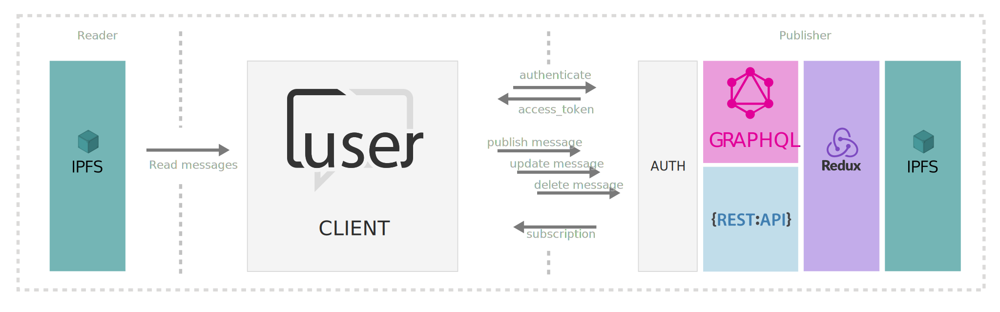

<h1 align="center">
  
</h1>

>**C**hatting via **U**ncentralized **S**ervice with **E**ndless **R**esources

<h3 align="center">No database, distributed message service, which provides a simple system to handle the resources through IPFS.</h3>

## Motivation

Many times I've try to create a webpage where the users can publish their opinions, but it becomes a hard task when you have to prepare an entire ecosystem to store such data. If the information is public, why not distribute such content all over the internet?.

Here is where `cuser` comes out, taking the powerfull of IPFS, stores the comments using the DAG graph.

This allows create [SPA's Single Page Aplications](https://es.wikipedia.org/wiki/Single-page_application) with capabilities of [statefull](https://www.atlantic.net/vps-hosting/what-is-stateless-stateful-models-web-development/) websites, blogs, etc... and minimize the storing impact of your server.

- Root CID represents the main article which is associated to a hash in IPFS, it can be created using the CID provider of IPFS if the article is not a IPFS distributed file. 

## Spam detection

IPFS manage the data in a fashion way, due the CID is generated using a checksum of the content data, so its really easy to track if the user is publishing the same content in many articles and restrict. A user can not publish repeated comments with the same content.

## Restricted comments tree

A user can only replay the last comment, so a user can not replay on himself. This allows to make a conversation where the user only has the capability (if a mistake) to edit his last post until other user continues the conversation. 

## Removing / Editing comments

Even though IPFS is a permanet store due p2p distribution, if a user wants to remove a comment, can be done using hash tree which is manipulated at the server side allowing remove or replace a blocks.

## Security 

A user can only edits/remove his owns comments, this is a feature which the `@cuser/server` takes on. Checking the user token which is provided by the server itself adding this security layer for prevent users to change other users comments.

## Ip detection

// coors enabled
// app token 
// user token

api rest
POST /api/v1/publish/

graphql

## Diagram 

## RSA pair kesy generator

https://travistidwell.com/jsencrypt/demo/

https://jwt.io/

CLIENT_ID token generated from private key 

USER_TOKEN token generated from public key
 user information
 - avatar
 - network: google, facebook, github, linkedin

SPA 

https://www.oauth.com/oauth2-servers/single-page-apps/

https://example-app.com/cb?code=Yzk5ZDczMzRlNDEwY&state=TY2OTZhZGFk

<a href="https://authorization-server.com/authorize?response_type=code
     &client_id=mRkZGFjM&state=TY2OTZhZGFk">Connect Your Account</a>

